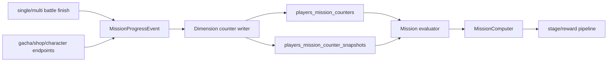

# Mission Dimension Progress Design

最后更新：2026-07-05

## 背景

当前任务系统已经具备分类计算器、阶段阈值解析、奖励解析和 `mission/get_mission_progress` 自动发奖流程。主要缺口不是奖励管线，而是“任务进度来源”仍然分散：部分来自 `players_quest_progress`，部分来自角色觉醒专用 tracker，部分来自客户端 `mission/update_mission_progress` 回传，部分还没有服务端化。

本设计目标是把任务进度抽象为可复用的“维度计数”，先覆盖战斗相关任务维度，再逐步迁移每日任务、角色觉醒任务、活动任务、周常任务和成就任务。

## 目标

1. 建立统一 `MissionProgressEvent`，让战斗、体力、抽卡、商店、角色养成等入口用同一种方式记录任务进度。
2. 建立可查询的维度计数器，支持 lifetime、daily、weekly、event、character 等作用域。
3. 保留现有 `MissionComputer` 和 `mission/update_mission_progress` fallback，避免未覆盖维度导致客户端任务断进度。
4. 第一批优先提升每日任务和角色觉醒任务的战斗维度覆盖，不提前实现完整周常和成就。

## 非目标

1. 不一次性重写全部任务系统。
2. 不删除现有 `players_active_missions`、`players_quest_progress`、角色觉醒 tracker 表。
3. 不在第一批实现所有 `battle_client_check` 变体；第一批只接入可从当前结算请求稳定取得的数据。
4. 不改变客户端接口形状，仍由 `get_mission_progress` 返回 `mission_progress_list`、`user_info`、`item_list`。

## 推荐架构



### 事件层

新增 `src/lib/mission/events.ts`，定义统一事件类型：

```ts
export type MissionProgressEvent =
    | BattleFinishMissionEvent
    | StaminaUseMissionEvent
    | GachaDrawMissionEvent
    | ShopPurchaseMissionEvent
    | CharacterGrowMissionEvent

export interface BattleFinishMissionEvent {
    type: "battle_finish"
    playerId: number
    questCategory: number
    questId: number
    accomplished: boolean
    mode: "single" | "multi"
    role?: "host" | "guest"
    clearRank?: number | null
    clearTimeMs: number
    clearPhase?: number
    partyCharacterIds: number[]
    leaderCharacterId?: number
    unisonCharacterIds: number[]
    statistics: {
        dashCount: number
        powerFlipCount: number
        skillCount: number
        maxComboCount: number
    }
    eventId?: number
}
```

战斗结算入口只负责把当前 `FinishContext` 转成事件。是否写哪些任务维度由维度写入层决定，避免在路由文件继续堆任务规则。

### 计数层

新增 SQLite 表：

```sql
CREATE TABLE IF NOT EXISTS players_mission_counters (
    player_id INTEGER NOT NULL,
    counter_key TEXT NOT NULL,
    dimension TEXT NOT NULL,
    scope_type TEXT NOT NULL,
    scope_key TEXT NOT NULL,
    qualifier_json TEXT NOT NULL,
    value INTEGER NOT NULL DEFAULT 0,
    updated_at TEXT NOT NULL,
    PRIMARY KEY (player_id, counter_key),
    FOREIGN KEY (player_id) REFERENCES players (id) ON DELETE CASCADE
);

CREATE TABLE IF NOT EXISTS players_mission_counter_snapshots (
    player_id INTEGER NOT NULL,
    period_type TEXT NOT NULL,
    counter_key TEXT NOT NULL,
    value INTEGER NOT NULL DEFAULT 0,
    updated_at TEXT NOT NULL,
    PRIMARY KEY (player_id, period_type, counter_key),
    FOREIGN KEY (player_id) REFERENCES players (id) ON DELETE CASCADE
);
```

`counter_key` 由 `dimension + scope_type + scope_key + stable qualifier_json` 生成。`qualifier_json` 必须按 key 排序，保证同一个查询条件生成同一个 key。

示例计数：

| dimension | scope_type | scope_key | qualifier |
| --- | --- | --- | --- |
| `battle.clear` | `lifetime` | `all` | `{ "mode": "single" }` |
| `battle.clear` | `lifetime` | `all` | `{ "mode": "multi" }` |
| `battle.quest_clear` | `lifetime` | `all` | `{ "questCategory": 13, "questId": 1020 }` |
| `battle.stat` | `lifetime` | `all` | `{ "kind": "dash" }` |
| `battle.phase_clear` | `lifetime` | `all` | `{ "phase": 3 }` |
| `character.battle_clear` | `character` | `111001` | `{ "position": "leader" }` |
| `character.co_clear` | `lifetime` | `all` | `{ "characters": "111001,131005" }` |

每日和周常不使用日期 key 直接写入 period counter，而是复用累计 counter，并在 daily/weekly reset 时记录 snapshot。计算周期进度时读取 `current - snapshot`。这与当前 `players_periodic_snapshots` 的思想一致，但支持任意维度。

### 维度写入层

新增 `src/lib/mission/battle-dimensions.ts`，从 `BattleFinishMissionEvent` 写入以下第一批维度：

| 维度 | 触发条件 | 用途 |
| --- | --- | --- |
| `battle.clear` | `accomplished=true` | 完成 X 场战斗、单人/协力通关 |
| `battle.quest_clear` | `accomplished=true` | 指定关卡、降临、讨伐、活动任务 |
| `battle.rank_clear` | `clearRank` 存在 | S/SS 等 clear rank 任务 |
| `battle.phase_clear` | `clearPhase` 存在 | time attack phase 任务 |
| `battle.stat` | dash/powerflip/skill/combo 统计存在 | 使用 dash、技能、强化弹射等任务 |
| `character.battle_clear` | party 中存在角色 | 使用 X 角色、X 队长 |
| `character.co_clear` | party 中有 2 个以上角色 | 多角色同队任务 |
| `character.race_clear` | 可解析角色种族 | 种族组合任务 |

第一批实现继续调用现有 `trackCharacterClears`、`trackLeaderPowerflip`、`trackPartyCoClears`、`trackPowerflip`，同时双写新 counter。角色觉醒计算器迁移完成后，再考虑删除旧专用读取。

### 评估层

新增 `src/lib/mission/evaluator.ts`，将任务定义转换为 counter 查询：

```ts
export interface MissionCounterQuery {
    dimension: string
    scopeType: "lifetime" | "event" | "character"
    scopeKey: string
    qualifier: Record<string, string | number | boolean>
    period?: "daily" | "weekly"
}

export interface MissionEvaluationResult {
    supported: boolean
    progress: number
    reason?: string
}
```

分类计算器调用 evaluator：

1. 如果任务 row 能解析成 counter query，则读取 counter。
2. 如果任务是 daily/weekly，则按 period snapshot 返回 `current - snapshot`。
3. 如果任务是 `target_mission_clear`，继续由 evaluator 递归计算依赖任务完成数，不写 counter。
4. 如果任务不支持，则返回 `supported=false`，调用方保留现有 DB progress fallback。

## 第一批任务映射

| 任务类型 | 来源 | 第一批处理 |
| --- | --- | --- |
| `single_battle_clear_count` | battle finish | 转 `battle.clear mode=single` |
| `multi_battle_clear_count` | battle finish | 转 `battle.clear mode=multi` |
| `battle_clear_count` | battle finish | 转 `battle.clear mode=any` |
| 指定 quest clear | battle finish + event map | 转 `battle.quest_clear` |
| `time_attack_clear_phase` | statistics.clear_phase | 转 `battle.phase_clear` |
| `use_dash` | statistics.zones | 转 `battle.stat kind=dash` |
| `use_power_flip` | statistics.zones | 转 `battle.stat kind=power_flip` |
| `use_skill` | statistics | 有字段时转 `battle.stat kind=skill`，无字段时 fallback |
| 使用 X 角色 | party stats | 转 `character.battle_clear position=any` |
| 使用 X 队长 | party stats | 转 `character.battle_clear position=leader` |
| 多角色同队 | party stats | 转 `character.co_clear` |
| daily all-clear | mission dependency | 继续用 evaluator 递归计算 |

## 每日与觉醒的隔离规则

监听事件不隔离，计数和评估隔离。

| 分类 | 监听 | 计数/评估 |
| --- | --- | --- |
| 每日任务 | 复用 battle/stamina/gacha 事件 | 使用 period=`daily`，读取 snapshot 差值 |
| 角色觉醒 | 复用 battle/party/character 事件 | 使用 lifetime 或 character scope，不按天重置 |
| 活动任务 | 复用 battle 事件 | 使用 quest/event qualifier 过滤 |
| 周常任务 | 复用 daily 同类事件 | 使用 period=`weekly`，暂不启用自动领奖 |

## 客户端对齐

客户端仍然可以调用 `mission/update_mission_progress`。服务端 evaluator 优先读取 counter；counter 不支持的任务继续读取 `players_active_missions.progress`。这样可以逐步减少客户端回传依赖，而不会破坏现有任务。

`battle_client_check` 不作为单一黑盒维度实现，而拆成具体可验证维度：通关、协力、角色、队长、关卡、rank、phase、dash、skill、combo。这样更容易和服务端已有结算数据对齐，也方便定位缺失字段。

## 错误处理

1. 事件缺少非关键字段时，不抛出接口错误，只跳过对应维度，并保留 DB/client fallback。
2. 事件缺少 `playerId`、`questId`、`questCategory` 等关键字段时，调用方不写 counter，并记录 warn 日志。
3. counter 写入使用事务，单个维度失败时回滚该事件的 counter 写入，避免半写。
4. evaluator 遇到不支持的 kind 或 qualifier 时返回 `supported=false`，不把 progress 写成 0 覆盖旧数据。
5. 周期 snapshot 缺失时，daily/weekly evaluator 以当前累计值作为进度；管理端 reset 后会写入 snapshot，后续按差值计算。

## 测试策略

1. 类型检查：每阶段运行 `npm run typecheck`。
2. counter key 稳定性：用 Node 脚本验证 qualifier key 顺序不同但生成同一 counter key。
3. battle event 写入：构造 `BattleFinishMissionEvent`，验证 single/multi/quest/character/stat counter 增量。
4. daily snapshot 差值：先写 counter=10，snapshot=7，验证 daily progress=3。
5. fallback：构造不支持的 mission kind，验证 evaluator 返回 `supported=false`，计算器保留 DB progress。
6. 接口回归：用现有 `get_mission_progress` 定向脚本验证每日奖励和觉醒奖励仍能发放。

## 分阶段交付

### Phase 1: Counter 基础设施

创建 `events.ts`、`counters.ts`、数据库表和 counter key 工具。此阶段不接入业务路由，目标是纯读写能力可验证。

### Phase 2: Battle 维度双写

在单人和多人战斗结算处生成 `BattleFinishMissionEvent`，调用 `recordBattleMissionDimensions`。保留现有 tracker，避免觉醒任务行为变化。

### Phase 3: Daily 任务迁移

将 daily 的 `single_battle_clear_count`、`multi_battle_clear_count`、`battle_clear_count`、`use_dash`、`time_attack_clear_phase` 等任务优先改为 counter evaluator。未支持的 daily kind 继续 fallback 到 DB/client progress。

### Phase 4: Awake 任务迁移

将普通角色出场、队长、同队、种族组合等读取迁移到 counter evaluator。硬编码特殊任务保留在 `computer-awake.ts`，直到能从 CDN 规则稳定解析。

### Phase 5: Event/Weekly/Achievement 扩展

活动任务复用 `mission_event_quest_map.json` 转成 quest qualifier。周常启用 weekly snapshot。成就任务在确认数据表和客户端分类后接入 lifetime scope。

## 验收标准

1. 新 counter 表创建后，旧存档可正常启动，不需要手动迁移。
2. 单人通关后，至少写入 `battle.clear`、`battle.quest_clear`、`character.battle_clear`。
3. 协力通关后，至少写入 `battle.clear mode=multi`，并保留原 `multi_clear_count` 更新。
4. daily 的协力通关任务不再完全依赖客户端 `update_mission_progress`。
5. 角色觉醒已有覆盖任务在迁移后进度不回退。
6. `get_mission_progress` 奖励发放流程保持当前行为。
7. 不向源码提交本地绝对路径、反编译目录路径或插件 URI。
